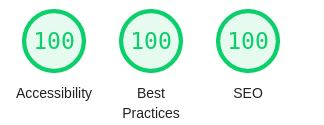

# In~Define Test App

This project was bootstrapped with [Create React App](https://github.com/facebook/create-react-app).

## Used Packages
| Name | Version |
| --- | --- |
| React | 17.0.2 |
| React Router Dom | 5.2.0
| React Helmet | 6.1.0 |
| Material UI | 4.11.4
| history | 5.0.0 |

## Lighthouse Score

## How to get running

In the project directory, you can run:

### `yarn install`

### `yarn start`

## Sketch Design
https://www.sketch.com/s/3ea18fa1-e492-4250-a28e-6df50c9fcba7

Runs the app in the development mode.\
Open [http://localhost:3000](http://localhost:3000) to view it in the browser.

The page will reload if you make edits.\
You will also see any lint errors in the console.

## Additional features and technologies
1. built understandable, succinct, and maintenable architecture.
2. built modular and functional components using React Hooks.
3. ensured performance resolving re-rendering issues and SEO principles in the test.
4. built pixel-perfect and responsive banner, and wrote CSS components using Material UI styles and hooks.
5. used the most latest technologies including ECMAScript.

## Learn More

You can learn more in the [Create React App documentation](https://facebook.github.io/create-react-app/docs/getting-started).

To learn React, check out the [React documentation](https://reactjs.org/).

### Code Splitting

This section has moved here: [https://facebook.github.io/create-react-app/docs/code-splitting](https://facebook.github.io/create-react-app/docs/code-splitting)

### Analyzing the Bundle Size

This section has moved here: [https://facebook.github.io/create-react-app/docs/analyzing-the-bundle-size](https://facebook.github.io/create-react-app/docs/analyzing-the-bundle-size)

### Making a Progressive Web App

This section has moved here: [https://facebook.github.io/create-react-app/docs/making-a-progressive-web-app](https://facebook.github.io/create-react-app/docs/making-a-progressive-web-app)

### Advanced Configuration

This section has moved here: [https://facebook.github.io/create-react-app/docs/advanced-configuration](https://facebook.github.io/create-react-app/docs/advanced-configuration)

### Deployment

This section has moved here: [https://facebook.github.io/create-react-app/docs/deployment](https://facebook.github.io/create-react-app/docs/deployment)

### `yarn build` fails to minify

This section has moved here: [https://facebook.github.io/create-react-app/docs/troubleshooting#npm-run-build-fails-to-minify](https://facebook.github.io/create-react-app/docs/troubleshooting#npm-run-build-fails-to-minify)
